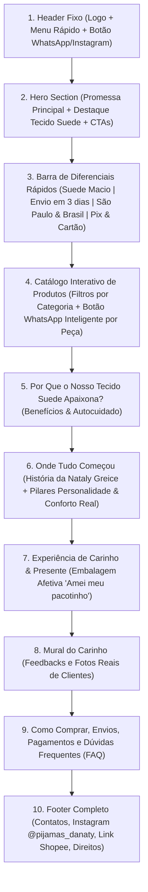

# 06. Arquitetura e Copywriting da Landing Page — Pijamas da Naty

> Planejamento estratégico de seções, funcionalidades e textos (copy) prontos para o desenvolvimento do site/catálogo da **Pijamas da Naty**.

---

## 1. Objetivo de Conversão da Página

O site foi concebido para cumprir o objetivo central do briefing:
> **"Apresentar o catálogo de produtos e adiantar o processo da venda."**

Para isso, em vez de um checkout complexo e burocrático, o site funcionará como um **Catálogo Interativo de Alta Conversão (Click-to-WhatsApp)**, onde a cliente:
1. Explora as categorias e fotos reais dos pijamas.
2. Seleciona o modelo/tamanho de interesse (ou monta sua sacolinha de interesse).
3. Clica em **"Pedir no WhatsApp"** e já envia uma mensagem estruturada direto para a Naty (`(11) 94883-5934`), reduzindo o tempo de atendimento e aumentando a taxa de fechamento.

---

## 2. Mapa de Seções do Site (Wireframe Lógico)

---

## 3. Copywriting Pronto por Seção

### Seção 1: Header (Navegação)
- **Marca:** Pijamas da Naty ✨ *(Conforto em todas as noites)*
- **Links de âncora:** `Catálogo` | `Diferenciais` | `Nossa História` | `Clientes` | `Dúvidas`
- **CTA no Topo:** `Falar com a Naty` (ícone do WhatsApp)

---

### Seção 2: Hero Section (Primeira Dobra)
- **Badge Superior:** `✨ Tecido Suede Ultra Macio • Envio Rápido`
- **Headline Principal (`H1`):**
  > **O abraço em forma de pijama que suas noites merecem.**
- **Subheadline:**
  > Descubra a leveza do nosso tecido Suede macio e delicado. Modelagens que valorizam o seu corpo sem apertar, para você se sentir linda, cuidada e confortável em todos os momentos de descanso.
- **Botão Primário (CTA 1):** `Ver Catálogo de Pijamas` *(rola suavemente para o catálogo)*
- **Botão Secundário (CTA 2):** `Atendimento no WhatsApp` *(abre `https://wa.me/5511948835934`)*
- **Micro-prova social abaixo dos botões:** `💜 Dezenas de clientes apaixonadas • Atendimento personalizado pela Naty`

---

### Seção 3: Faixa de Confiança e Benefícios (Trust Bar)
1. ☁️ **Toque Suede Delicado:** Sensação aveludada que não pinica, não encolhe e não desbota.
2. 📦 **Envio Ágil:** Postagem em até 3 dias e entrega rápida em até 7 dias úteis.
3. 💳 **Pagamento Facilitado:** Aceitamos Pix, Cartão de Crédito e Débito.
4. 🎁 **Feito com Carinho:** Embalagem especial que encanta desde o momento em que chega.

---

### Seção 4: Catálogo de Produtos (Adiantar o Processo de Venda)
- **Título da Seção:** `Escolha o Seu Momento de Conforto`
- **Subtítulo:** `Clique no seu modelo favorito para verificar as estampas e tamanhos disponíveis agora mesmo no WhatsApp.`
- **Abas de Filtro:**
  - `Todos`
  - `Americano de Calor` *(Destaque 01)*
  - `Alça Fina / Short Doll` *(Destaque 02)*
  - `Americano Longo`
  - `Renda & Sofisticação`
  - `Mãe & Filha / Família`

#### Produtos Iniciais para Cadastro no Catálogo:
1. **Pijama Americano de Calor — Suede Estampado (Gatinhos)**
   - *Badge:* `⭐ Mais Pedido`
   - *Descrição:* Abertura frontal com botões funcionais, viés contrastante e shorts soltinho em tecido Suede macio e fresco.
   - *Mensagem WhatsApp:* `"Olá Naty! Vi no site o *Pijama Americano de Calor (Suede)* e gostaria de verificar as estampas, tamanhos e valores disponíveis!"`
2. **Pijama Regata Alça Fina — Suede Lavanda c/ Viés Branco**
   - *Badge:* `⭐ Destaque de Verão`
   - *Descrição:* Alças finas reguláveis, lacinho delicado e caimento leve que se adapta ao corpo sem apertar.
   - *Mensagem WhatsApp:* `"Olá Naty! Vi no site o *Pijama Regata de Alça Fina (Lavanda)* e gostaria de saber tamanhos e valores disponíveis!"`
3. **Pijama Regata Alça Fina — Estampa Divertida (Minnie)**
   - *Badge:* `Estampa Exclusiva`
   - *Descrição:* Todo o charme e frescor da alça regulável com shorts soltinho em estampa fofa e apaixonante.
   - *Mensagem WhatsApp:* `"Olá Naty! Amei o *Pijama Alça Fina Estampado (Minnie)* que vi no site! Quais tamanhos e estampas você tem disponíveis?"`
4. **Pijama Short Doll — Estampa Ursinhos & Laços**
   - *Badge:* `Sucesso entre Clientes`
   - *Descrição:* Delicado, romântico e super macio. Perfeito para noites tranquilas ou para presentear quem você ama.
   - *Mensagem WhatsApp:* `"Olá Naty! Vi no site o *Pijama Estampa Ursinhos & Laços* e quero consultar disponibilidade e valor!"`
5. **Baby Doll Preto com Renda Delicada**
   - *Badge:* `Linha Sofisticada`
   - *Descrição:* Decote em V e barra do shorts trabalhados em renda delicada e elegante, com toque macio e caimento impecável.
   - *Mensagem WhatsApp:* `"Olá Naty! Vi no site o *Baby Doll Preto com Renda* e gostaria de saber valores e tamanhos disponíveis!"`
6. **Pijama Americano Longo — Rosa Bebê c/ Viés Branco**
   - *Badge:* `Clássico Elegante`
   - *Descrição:* Conjunto longo de botões com acabamento em viés contrastante. Ideal para dormir bem e ficar elegante em casa.
   - *Mensagem WhatsApp:* `"Olá Naty! Vi no site o *Pijama Americano Longo* e gostaria de verificar cores, tamanhos e valores!"`
7. **Kit Combinado Mãe & Filha(o) — Pijama Americano**
   - *Badge:* `Família & Amor`
   - *Descrição:* Pijamas combinando para eternizar momentos especiais em família com o mesmo toque macio para adultos e crianças.
   - *Mensagem WhatsApp:* `"Olá Naty! Vi no site a opção de *Kit Mãe e Filha / Família* e gostaria de consultar opções e valores!"`
8. **Linha Masculina & Infantil Sob Consulta**
   - *Badge:* `Para Todos`
   - *Descrição:* Também contamos com opções confortáveis para o público masculino e infantil. Consulte as peças disponíveis!
   - *Mensagem WhatsApp:* `"Olá Naty! Gostaria de ver as opções de pijamas *Masculinos / Infantis* disponíveis!"`

---

### Seção 5: Onde Tudo Começou (Sobre a Naty & Propósito)
*(Utiliza os textos exatos validados nas lâminas da marca)*
- **Subtítulo:** `Onde Tudo Começou — A história de um abraço em forma de roupa.`
- **Título:** `Uma Paixão de Menina`
- **Texto:**
  > "Sabe aquele momento do dia em que a gente finalmente chega em casa e veste aquela roupa que parece um abraço? Para mim, esse momento sempre foi sagrado.  
  > Desde menina, eu sempre fui apaixonada por pijamas delicados, cheios de personalidade e que trouxessem leveza para o meu descanso."  
  > — **Nataly Greice**, Fundadora da Pijamas da Naty
- **Cards de Autocuidado ("O Pijama como Autocuidado"):**
  - **Personalidade:** *"Buscava peças que fossem mais que 'roupas de dormir'. Queria algo que me fizesse sentir linda e cuidada, mesmo na hora de descansar."*
  - **Conforto Real:** *"O foco sempre foi o toque do tecido na pele. Aquela sensação macia que acalma os sentidos após um dia longo."*

---

### Seção 6: Como Funciona a Compra Rápida (Passo a Passo para Adiantar a Venda)
1. **1. Escolha seu Modelo no Site:** Navegue pelo catálogo e clique no pijama que mais combinou com você.
2. **2. Confirme Estampa e Tamanho no WhatsApp:** Você será atendida diretamente pela Naty com fotos reais das peças disponíveis a pronta-entrega.
3. **3. Pagamento Seguro e Envio Rápido:** Pague via Pix ou Cartão e receba seu pacotinho cheio de amor (postagem em até 3 dias!).

---

### Seção 7: Prova Social ("Quem Veste, Se Apaixona")
- **Título:** `Ver o meu trabalho fazendo parte de momentos especiais é o que me motiva todos os dias!`
- **Cards de Depoimentos + Galeria de Prints Reais do WhatsApp/Instagram:**
  - *"Obrigado Naty eu amei! Super macio e confortável 💜🥰"*
  - *"Fiquei maravilhosa"*
  - *"Oi linda recebi os meus adorei... ficou bom o Carlos gostou"* — Dona Denise
  - *"Adorei!"*

---

### Seção 8: Perguntas Frequentes (FAQ)
- **Qual é o tecido dos pijamas?**
  Trabalhamos principalmente com o tecido **Suede macio e delicado**, muito elogiado pelas nossas clientes pelo toque aveludado, frescor, durabilidade e por não encolher nem desbotar. Também temos opções especiais com acabamento em renda delicada.
- **Qual o prazo de envio e entrega?**
  Seu pedido é preparado com todo carinho e enviado em **até 3 dias**. O prazo médio de entrega após o envio é de **até 7 dias úteis**. Atendemos toda São Paulo e também enviamos via Shopee/Correios.
- **Quais são as formas de pagamento?**
  Aceitamos **Pix**, **Cartão de Crédito** e **Cartão de Débito** (no débito, a taxa da operação fica por conta do comprador).
- **Como funciona a política de trocas?**
  Por se tratar de peças íntimas e de descanso, realizamos trocas **somente em caso de defeito de fabricação**. Mas fique tranquila: no atendimento pelo WhatsApp, ajudamos você a escolher a numeração ideal para o seu corpo!
- **Vocês têm pijamas infantis e masculinos?**
  Sim! Além da nossa linha principal feminina (20+), também atendemos o público infantil, masculino e kits combinando (Mãe e Filha). Chame no WhatsApp para ver as estampas disponíveis.

---

## 4. Links Úteis Prontos para Implementação no Código

- **WhatsApp Geral:** `https://wa.me/5511948835934?text=Ol%C3%A1%20Naty!%20Vim%20pelo%20site%20e%20gostaria%20de%20ver%20o%20cat%C3%A1logo%20de%20pijamas%20dispon%C3%ADveis!`
- **Instagram Oficial:** `https://www.instagram.com/pijamas_danaty/`
- **Loja Shopee Oficial:** `https://s.shopee.com.br/AAFJfbMLTu`
